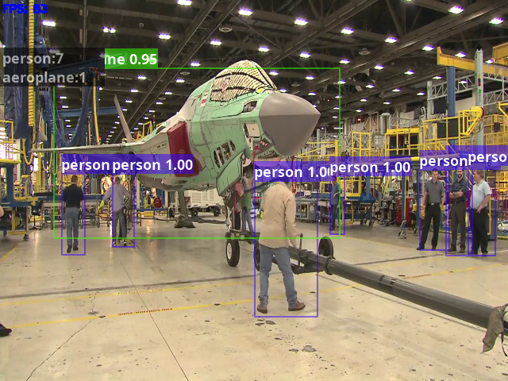

# yolo3_torch

本项目基于[PyTorch-YOLOv3](https://github.com/eriklindernoren/PyTorch-YOLOv3)修改

## 优化项

1. 使其更多的基于矩阵运算而不是使用循环，使训练速度提升40%左右
2. 支持视频检测
3. 加入跳帧处理，提升FPS

## 示例

| GPU    | Video Size | Reshape Size | FPS      |
| ------ | ---------- | ------------ | -------- |
| 1070ti | 640 x 480  | 416          | 80 - 120 |

